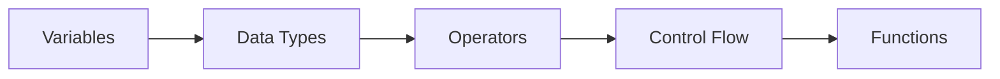

# Python-Programs
This repository is for the collection of my own created python programs (unique and learner-friendly). Everyone can access to this and learn while uplifting their journey.
# 🐍 Python Programs - Your Gateway to Programming Excellence

<div align="center">


### 🚀 *Empowering the Next Generation of Python Developers*

**A comprehensive collection of Python programs designed to transform beginners into confident programmers**

[📚 Explore Programs](#-programs-showcase) • [🎯 Learning Path](#-complete-python-learning-roadmap) • [🛠️ Setup Guide](#-getting-started) • [🤝 Contribute](#-contributing)

</div>

---

## 🌟 Welcome to Python Programming Universe

Welcome to **Python Programs** - your ultimate destination for mastering Python programming! This repository is meticulously crafted for aspiring developers, students, and programming enthusiasts who want to embark on an exciting journey into the world of Python.

### ✨ What Makes This Repository Special?

🎯 **Beginner-Friendly Approach** - Every program comes with detailed explanations and comments  
💡 **Practical Learning** - Real-world examples that you can immediately apply  
📈 **Progressive Difficulty** - From basic syntax to advanced concepts  
🔧 **Hands-on Experience** - Interactive programs that encourage experimentation  
📖 **Comprehensive Documentation** - Clear instructions and learning materials  

---

## 🎨 Programs Showcase

### 🏗️ **Fundamentals & Core Concepts**
```python
# Sample: Variables and Data Types
name = "Python Enthusiast" 🚀
age = 25
is_learning = True
```

- **Variables & Data Types** - Master Python's building blocks
- **Control Structures** - If-else, loops, and decision making
- **Functions** - Code reusability and modular programming
- **File Operations** - Reading, writing, and manipulating files

### 🎮 **Interactive & Fun Programs**
- **Games Collection** - Tic-tac-toe, Number guessing, Rock-paper-scissors
- **Text Adventures** - Story-based interactive programs
- **Puzzles & Challenges** - Logic building exercises
- **ASCII Art Generators** - Creative text-based graphics

### 🔢 **Mathematical & Algorithmic**
- **Number Theory** - Prime numbers, Fibonacci sequences
- **Sorting Algorithms** - Bubble sort, Quick sort, Merge sort
- **Search Algorithms** - Binary search, Linear search
- **Mathematical Computations** - Calculators, converters, generators

### 🌐 **Real-World Applications**
- **Web Scrapers** - Extract data from websites
- **File Organizers** - Automated file management
- **Data Processors** - CSV, JSON, XML handling
- **Automation Scripts** - Task automation utilities

---

## 🐍 Complete Python Learning Roadmap

### 🤔 **What is Python?**

Python is a **high-level, interpreted programming language** renowned for its:

- 📖 **Readable Syntax** - Write code that looks like natural English
- 🚀 **Versatility** - One language, countless applications
- 🌍 **Massive Community** - Millions of developers worldwide
- 📚 **Rich Libraries** - Pre-built solutions for almost everything
- 💼 **Industry Adoption** - Used by Google, Netflix, Instagram, Spotify

### 🎯 **Why Learn Python in 2024?**

| **Reason** | **Impact** |
|------------|------------|
| 🚀 **Easy to Learn** | Perfect first programming language |
| 💰 **High Salary Potential** | Average salary: $75,000 - $150,000+ |
| 📈 **Growing Demand** | #1 most in-demand programming skill |
| 🔧 **Multiple Career Paths** | Web dev, AI, data science, automation |
| 🌐 **Cross-Platform** | Works on Windows, Mac, Linux |

---

## 🛤️ **Your Python Learning Journey**

### **Phase 1: Foundation Building (Weeks 1-4)**


**Core Concepts:**
- Variables and Data Types
- Input/Output Operations
- Conditional Statements
- Loops (for, while)
- Functions and Parameters
- Error Handling

### **Phase 2: Intermediate Skills (Weeks 5-8)**
- Object-Oriented Programming
- File I/O Operations
- Exception Handling
- Modules and Packages
- Regular Expressions
- Working with APIs

### **Phase 3: Specialization (Weeks 9-12)**
Choose your path based on career goals:

---

## 🚀 Career Paths & Specializations

### 🌐 **Web Development**
**Build dynamic websites and web applications**

**🛠️ Essential Libraries & Frameworks:**
- **Django** - Full-featured web framework
- **Flask** - Lightweight and flexible
- **FastAPI** - Modern, high-performance API framework
- **HTML/CSS/JavaScript** - Frontend technologies

**💼 Career Opportunities:**
- Full-Stack Developer ($70K - $130K)
- Backend Developer ($75K - $125K)
- Django Developer ($80K - $140K)

### 🤖 **Artificial Intelligence & Machine Learning**
**Create intelligent systems and predictive models**

**🛠️ Essential Libraries:**
- **TensorFlow** - Deep learning framework
- **PyTorch** - Research-oriented ML library
- **Scikit-learn** - Classical machine learning
- **OpenCV** - Computer vision
- **NLTK/spaCy** - Natural language processing

**💼 Career Opportunities:**
- AI Engineer ($90K - $180K)
- Machine Learning Engineer ($100K - $200K)
- Data Scientist ($85K - $165K)

### 📊 **Data Science & Analytics**
**Extract insights from data to drive business decisions**

**🛠️ Essential Libraries:**
- **Pandas** - Data manipulation
- **NumPy** - Numerical computing
- **Matplotlib/Seaborn** - Data visualization
- **Jupyter** - Interactive development
- **SQL** - Database querying

**💼 Career Opportunities:**
- Data Analyst ($60K - $110K)
- Data Scientist ($85K - $165K)
- Business Intelligence Analyst ($70K - $120K)

### 🔧 **Automation & DevOps**
**Automate repetitive tasks and manage infrastructure**

**🛠️ Essential Tools:**
- **Selenium** - Web automation
- **Beautiful Soup** - Web scraping
- **Ansible** - Configuration management
- **Docker** - Containerization
- **AWS/Azure** - Cloud platforms

**💼 Career Opportunities:**
- Automation Engineer ($75K - $135K)
- DevOps Engineer ($85K - $155K)
- Site Reliability Engineer ($90K - $170K)

### 📱 **Desktop Application Development**
**Create cross-platform desktop applications**

**🛠️ Essential Frameworks:**
- **Tkinter** - Built-in GUI library
- **PyQt/PySide** - Advanced GUI applications
- **Kivy** - Multi-platform apps
- **Electron + Python** - Modern desktop apps

**💼 Career Opportunities:**
- Desktop Application Developer ($65K - $120K)
- Software Engineer ($70K - $130K)

### 🎮 **Game Development**
**Build games and interactive entertainment**

**🛠️ Essential Libraries:**
- **Pygame** - 2D game development
- **Panda3D** - 3D game engine
- **Arcade** - Modern game library
- **Unity + Python** - Professional game development

**💼 Career Opportunities:**
- Game Developer ($60K - $120K)
- Gameplay Programmer ($70K - $140K)

---

## 🛠️ Getting Started

### **Prerequisites**
- 💻 A computer with internet connection
- 🧠 Curiosity and willingness to learn
- ⏰ 1-2 hours daily commitment

### **Installation Guide**

#### **Step 1: Install Python**
```bash
# Windows/Mac: Download from python.org
# Ubuntu/Debian:
sudo apt update
sudo apt install python3 python3-pip

# Verify installation
python3 --version
```

#### **Step 2: Set Up Development Environment**
```bash
# Install VS Code (Recommended)
# Or use PyCharm, Sublime Text, or any text editor

# Essential packages
pip install jupyter notebook pandas numpy matplotlib
```

#### **Step 3: Clone This Repository**
```bash
git clone https://github.com/DipanT18/Python-Programs.git
cd Python-Programs
```

#### **Step 4: Start Learning!**
```bash
# Run your first program
python3 hello_world.py
```

---

## 📖 How to Use This Repository

### **🗂️ Repository Structure**
```
Python-Programs/
├── 📁 Basics/
│   ├── variables.py
│   ├── loops.py
│   └── functions.py
├── 📁 Games/
│   ├── tic_tac_toe.py
│   ├── number_guessing.py
│   └── rock_paper_scissors.py
├── 📁 Algorithms/
│   ├── sorting.py
│   ├── searching.py
│   └── recursion.py
├── 📁 Projects/
│   ├── calculator.py
│   ├── todo_list.py
│   └── web_scraper.py
└── 📁 Advanced/
    ├── oop_concepts.py
    ├── file_handling.py
    └── api_integration.py
```

### **🎯 Learning Approach**
1. **📖 Read** - Start with the code comments and documentation
2. **🔧 Run** - Execute the programs to see them in action
3. **🎨 Modify** - Change variables and see different outcomes
4. **🔨 Build** - Create your own variations
5. **🤝 Share** - Contribute your improvements back

---

## 🎯 Learning Milestones

- [ ] **Week 1:** Complete basic syntax programs
- [ ] **Week 2:** Build your first interactive program
- [ ] **Week 3:** Create a simple game
- [ ] **Week 4:** Implement basic algorithms
- [ ] **Week 6:** Develop a small project
- [ ] **Week 8:** Choose your specialization path
- [ ] **Week 12:** Build a portfolio project

---

## 🤝 Contributing

We welcome contributions from developers of all skill levels! Here's how you can help:

### **🌟 Ways to Contribute**
- 🐛 **Bug Fixes** - Found an issue? Help us fix it!
- 📝 **Documentation** - Improve explanations and comments
- 💡 **New Programs** - Add interesting and educational programs
- 🎨 **Enhancements** - Optimize existing code
- 🌍 **Translations** - Help make content accessible globally

### **📋 Contribution Guidelines**
1. Fork the repository
2. Create a feature branch (`git checkout -b feature/amazing-program`)
3. Commit your changes (`git commit -m 'Add amazing program'`)
4. Push to the branch (`git push origin feature/amazing-program`)
5. Open a Pull Request

---

## 🌟 Success Stories

> *"This repository helped me land my first programming job! The structured approach and real-world examples made all the difference."* - **Sarah Chen, Software Developer**

> *"Started as a complete beginner, now I'm building web applications with Django. Thank you for this amazing resource!"* - **Michael Rodriguez, Full-Stack Developer**

> *"The game development section inspired me to create my own indie game. Currently working at a game studio!"* - **Alex Thompson, Game Developer**

---

## 📚 Additional Resources

### **📖 Recommended Books**
- "Python Crash Course" by Eric Matthes
- "Automate the Boring Stuff with Python" by Al Sweigart
- "Effective Python" by Brett Slatkin

### **🌐 Online Platforms**
- [Python.org Official Tutorial](https://docs.python.org/3/tutorial/)
- [Real Python](https://realpython.com/)
- [Python Institute](https://pythoninstitute.org/)

### **🎥 Video Courses**
- freeCodeCamp Python Course
- Python for Everybody (Coursera)
- Complete Python Bootcamp (Udemy)

---

## 📞 Support & Community

### **💬 Get Help**
- 📧 **Email:** [dipantimalsina055@gmail.com]
- 🐦 **Twitter:** [@dipantimalsina]
- 💼 **LinkedIn:** [Error occured now, available in some days]

### **🤝 Connect with Fellow Learners**
- Share your projects on social media with `#PythonPrograms`
- Join Python communities and forums
- Participate in coding challenges
- Attend local Python meetups

---

## 📄 License

This project is licensed under the MIT License - see the [LICENSE](LICENSE) file for details.

---

## 🙏 Acknowledgments

Special thanks to:
- The Python community for continuous inspiration
- All contributors who help improve this repository
- Educational institutions promoting programming literacy
- Open source maintainers making learning accessible

---

<div align="center">

### 🚀 **Ready to Start Your Python Journey?**

**Star ⭐ this repository if it helped you!**

[](https://github.com/DipanT18/Python-Programs/stargazers)
[](https://github.com/DipanT18/Python-Programs/network)

---

*Made with ❤️ for the Python community*

**Happy Coding! 🐍✨**

</div>
